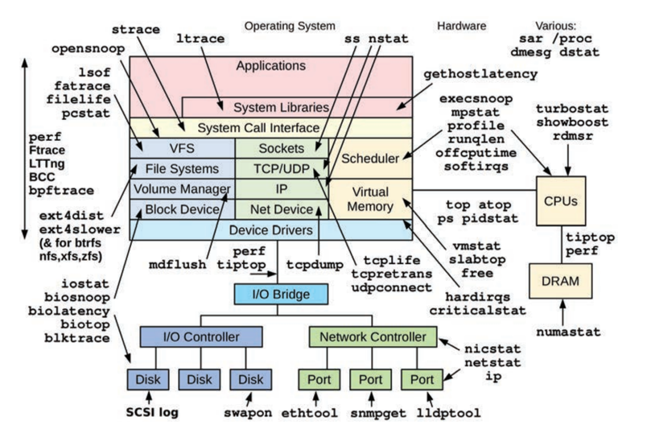
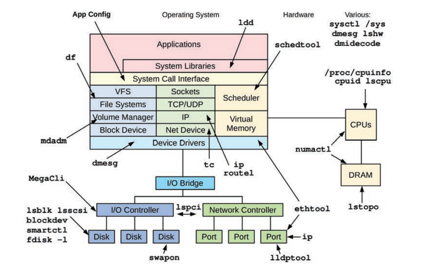
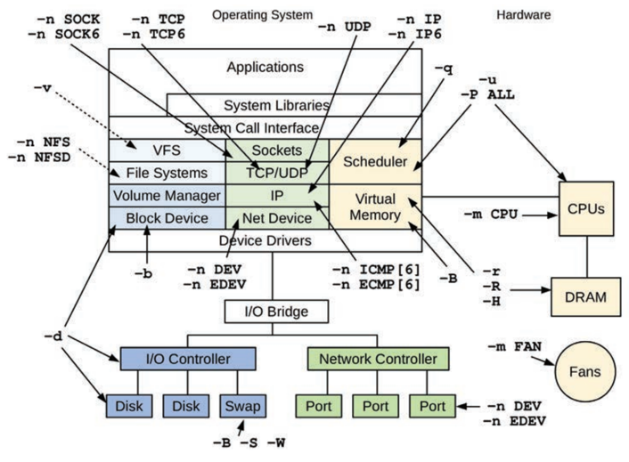
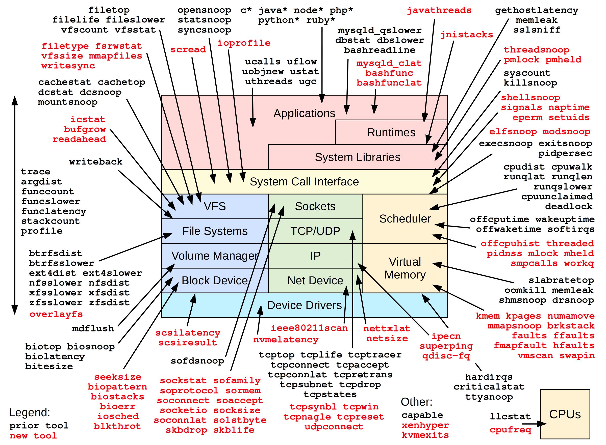

# README

Analysis and diagnoistcs tools for linux system performance.

# STAP

stap: analysis and diagnoistcs tools for linux system based on [SystemTap](https://sourceware.org/systemtap/).

[stap README](./stap/README.md)

# TODO

https://github.com/iovisor/bcc

https://github.com/brendangregg/bpf-perf-tools-book

https://elixir.bootlin.com/linux/v3.10/source

# 文档助手

## 常用的辅助文档

> - <a target="_blank" style="color: #08c;" href="https://man7.org/linux/man-pages/dir_by_project.html">Linux manual pages:directory by project</a>
> - <a target="_blank" style="color: #08c;" href="https://www.kernel.org/doc/html/v5.0/networking/snmp_counter.html">SNMP</a>
> - <a target="_blank" style="color: #08c;" href="https://www.kernel.org/doc/Documentation/filesystems/proc.txt">proc</a>
> - <a target="_blank" style="color: #08c;" href="https://man7.org/linux/man-pages/man5/proc.5.html">proc</a>
> - <a target="_blank" style="color: #08c;" href="https://www.brendangregg.com/">Brendan Gregg's Homepage</a>
> - <a target="_blank" style="color: #08c;" href="https://arthas.aliyun.com/doc/">Arthas</a>

## 动态追踪技术

一般优先使用传统工具进行观测

> - <a target="_blank" style="color: #08c;" href="https://blog.openresty.com.cn/cn/dynamic-tracing/">动态追踪技术漫谈</a>
> - Systemtap: 动态追踪框架
>> - <a target="_blank" style="color: #08c;" href="https://sourceware.org/systemtap/SystemTap_Beginners_Guide/index.html">SystemTap Beginners Guide</a>
>> - <a target="_blank" style="color: #08c;" href="https://sourceware.org/systemtap/tutorial/">SystemTap Tutorial</a>
>> - <a target="_blank" style="color: #08c;" href="https://sourceware.org/systemtap/examples/index.html">SystemTap Examples</a>
>> - <a target="_blank" style="color: #08c;" href="https://sourceware.org/systemtap/tapsets/">SystemTap Tapset Reference Manual</a>
>> - <a target="_blank" style="color: #08c;" href="https://sourceware.org/systemtap/langref/">SystemTap Language Reference</a>
> - eBPF
>> - <a target="_blank" style="color: #08c;" href="https://www.brendangregg.com/ebpf.html">Linux Extended BPF (eBPF) Tracing Tools</a>
>> - 需要较高内核的版本支持

# Tools

## Linux workload observability tools

## Linux static performance tuning tools

## Linux crisis tool packages

| Package    | Provides |
| ---------- | -------- |
| procps     | ps(1), vmstat(8), uptime(1), top(1) |
| util-linux | dmesg(1), lsblk(1), lscpu(1) |
| sysstat    | iostat(1), mpstat(1), pidstat(1), sar(1) |
| iproute2   | ip(8), ss(8), nstat(8), tc(8) |
| numactl    | numastat(8)  |
| linux-tools-common linux-tools-$(uname -r)  |  perf(1), turbostat(8)  |
| [bcc-tools (aka bpfcc-tools)](https://github.com/iovisor/bcc)  | opensnoop(8), execsnoop(8), runqlat(8), runqlen(8), softirqs(8), hardirqs(8), ext4slower(8), ext4dist(8), biotop(8), biosnoop(8), biolatency(8), tcptop(8), tcplife(8), trace(8), argdist(8), funccount(8), stackcount(8), profile(8), and many more  |
| [bpftrace](https://github.com/brendangregg/bpf-perf-tools-book)   | bpftrace, basic versions of opensnoop(8),execsnoop(8), runqlat(8), runqlen(8), biosnoop(8), biolatency(8), and more |
| [perf-tools-unstable](https://github.com/brendangregg/perf-tools)  | Ftrace versions of opensnoop(8), execsnoop(8),iolatency(8), iosnoop(8), bitesize(8), funccount(8), kprobe(8)  |
| trace-cmd  | trace-cmd(1) |
| nicstat    | nicstat(1) |
| ethtool    | ethtool(8)|
| tiptop     | tiptop(1) |
| msr-tools   | rdmsr(8), wrmsr(8) |
| [msr-cloud-tools](https://github.com/brendangregg/msr-cloud-tools) | showboost(8), cpuhot(8), cputemp(8) |
| [pmc-cloud-tools](https://github.com/brendangregg/pmc-cloud-tools) | pmcarch(8), cpucache(8), icache(8), tlbstat(8), resstalls(8) | 

## sar

## BPF Performance Tools

This is the official repository of BPF (eBPF) tools from the book [BPF Performance Tools: Linux and Application Observability](https://www.brendangregg.com/bpf-performance-tools-book.html).

