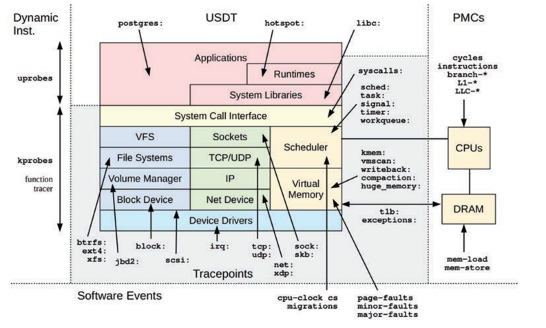
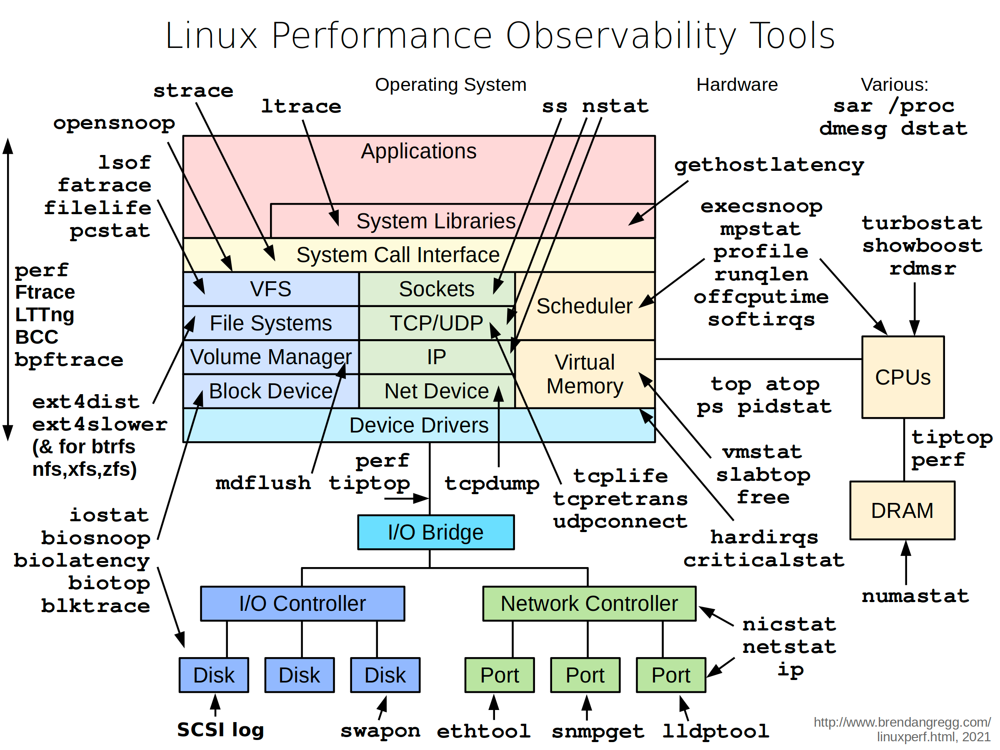
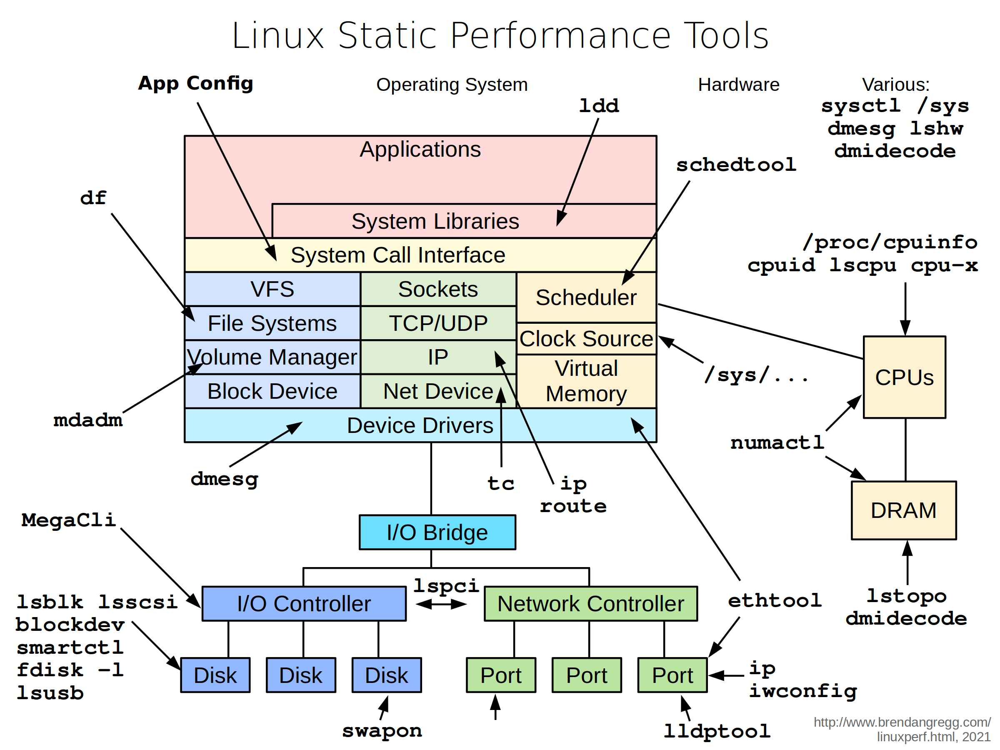
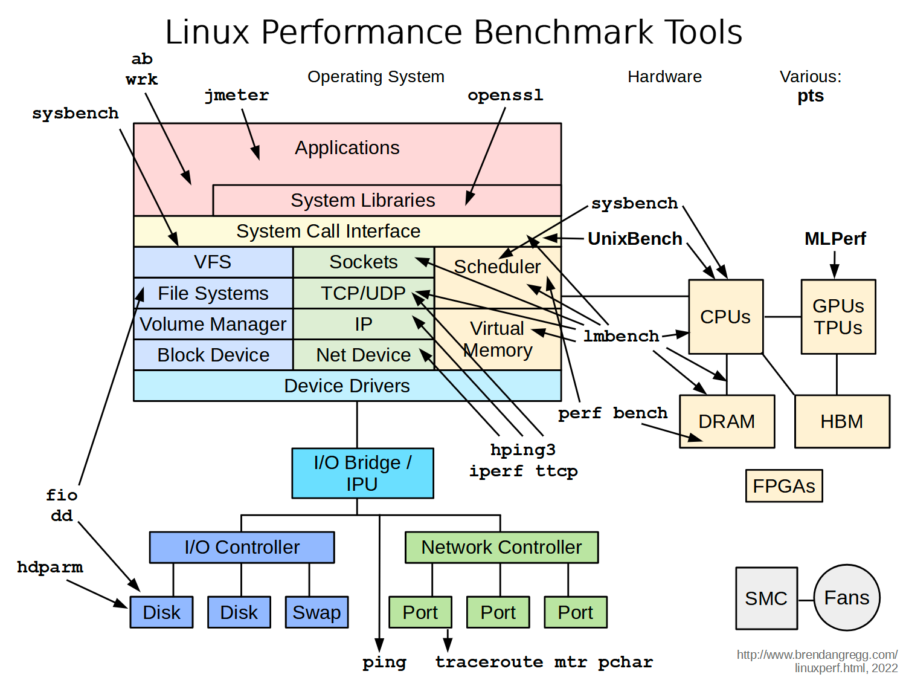
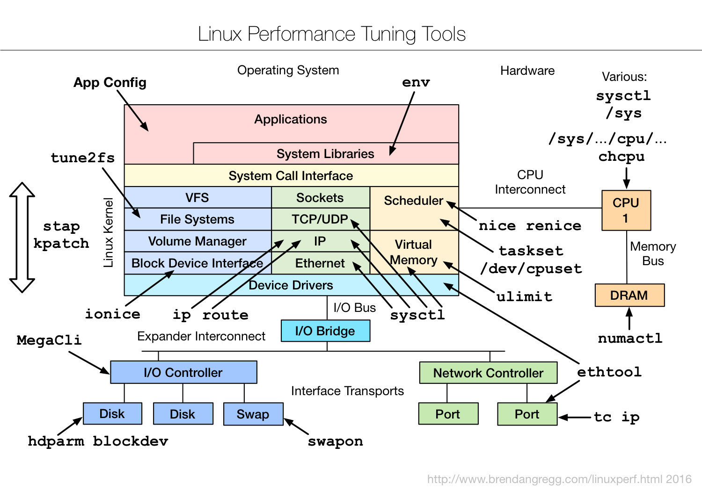
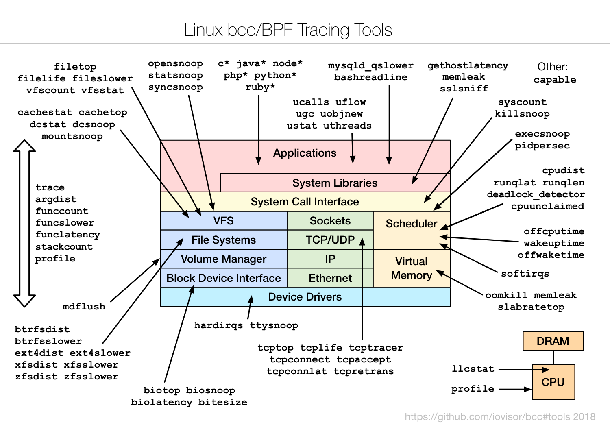
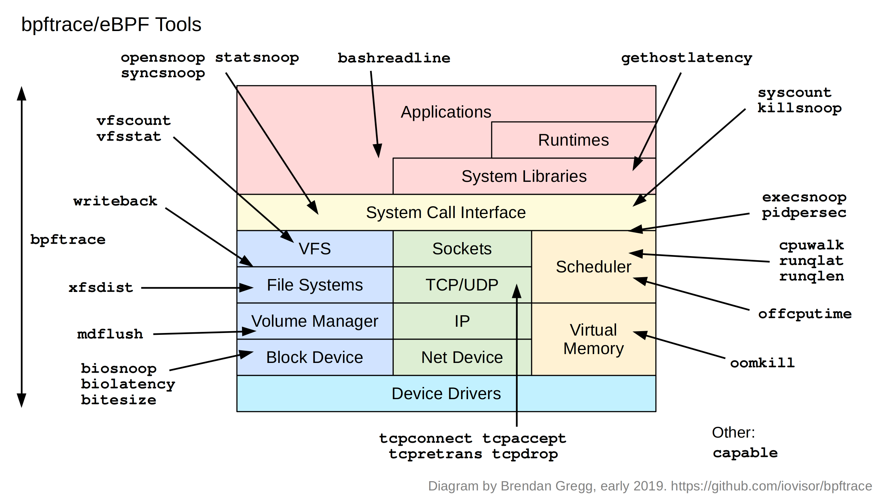
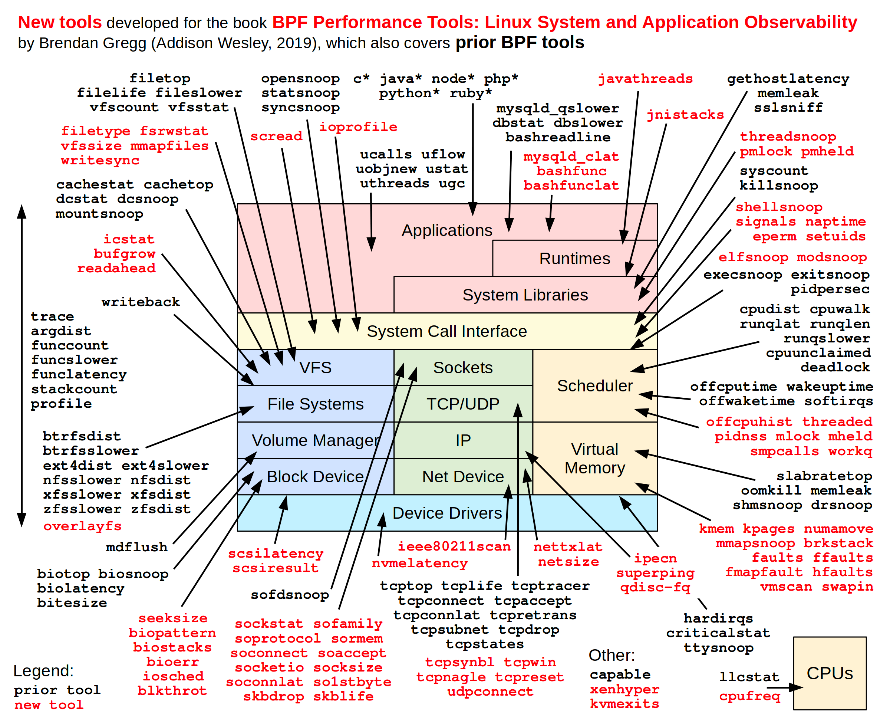

# README

Analysis and diagnoistcs tools for linux system performance.

# STAP

stap: analysis and diagnoistcs tools for linux system based on [SystemTap](https://sourceware.org/systemtap/).

[stap README](./stap/README.md)

# TODO

https://github.com/iovisor/bcc

https://github.com/brendangregg/bpf-perf-tools-book

https://elixir.bootlin.com/linux/v3.10/source

# 文档助手

## 常用的辅助文档

> - <a target="_blank" style="color: #08c;" href="https://man7.org/linux/man-pages/dir_by_project.html">Linux manual pages:directory by project</a>
> - <a target="_blank" style="color: #08c;" href="https://www.kernel.org/doc/html/v5.0/networking/snmp_counter.html">SNMP</a>
> - <a target="_blank" style="color: #08c;" href="https://www.kernel.org/doc/Documentation/filesystems/proc.txt">proc</a>
> - <a target="_blank" style="color: #08c;" href="https://man7.org/linux/man-pages/man5/proc.5.html">proc</a>
> - <a target="_blank" style="color: #08c;" href="https://www.brendangregg.com/">Brendan Gregg's Homepage</a>
> - <a target="_blank" style="color: #08c;" href="https://arthas.aliyun.com/doc/">Arthas</a>

## 动态追踪技术

一般优先使用传统工具进行观测

> - <a target="_blank" style="color: #08c;" href="https://blog.openresty.com.cn/cn/dynamic-tracing/">动态追踪技术漫谈</a>
> - Systemtap: 动态追踪框架
>> - <a target="_blank" style="color: #08c;" href="https://sourceware.org/systemtap/SystemTap_Beginners_Guide/index.html">SystemTap Beginners Guide</a>
>> - <a target="_blank" style="color: #08c;" href="https://sourceware.org/systemtap/tutorial/">SystemTap Tutorial</a>
>> - <a target="_blank" style="color: #08c;" href="https://sourceware.org/systemtap/examples/index.html">SystemTap Examples</a>
>> - <a target="_blank" style="color: #08c;" href="https://sourceware.org/systemtap/tapsets/">SystemTap Tapset Reference Manual</a>
>> - <a target="_blank" style="color: #08c;" href="https://sourceware.org/systemtap/langref/">SystemTap Language Reference</a>
> - eBPF
>> - <a target="_blank" style="color: #08c;" href="https://www.brendangregg.com/ebpf.html">Linux Extended BPF (eBPF) Tracing Tools</a>
>> - 需要较高内核的版本支持

# Tools

[linux perf](https://www.brendangregg.com/linuxperf.html)

## Linux crisis tool packages

| Package    | Provides |
| ---------- | -------- |
| procps     | ps(1), vmstat(8), uptime(1), top(1) |
| util-linux | dmesg(1), lsblk(1), lscpu(1) |
| sysstat    | iostat(1), mpstat(1), pidstat(1), sar(1) |
| iproute2   | ip(8), ss(8), nstat(8), tc(8) |
| numactl    | numastat(8)  |
| linux-tools-common linux-tools-$(uname -r)  |  perf(1), turbostat(8)  |
| [bcc-tools (aka bpfcc-tools)](https://github.com/iovisor/bcc)  | opensnoop(8), execsnoop(8), runqlat(8), runqlen(8), softirqs(8), hardirqs(8), ext4slower(8), ext4dist(8), biotop(8), biosnoop(8), biolatency(8), tcptop(8), tcplife(8), trace(8), argdist(8), funccount(8), stackcount(8), profile(8), and many more  |
| [bpftrace](https://github.com/brendangregg/bpf-perf-tools-book)   | bpftrace, basic versions of opensnoop(8),execsnoop(8), runqlat(8), runqlen(8), biosnoop(8), biolatency(8), and more |
| [perf-tools-unstable](https://github.com/brendangregg/perf-tools)  | Ftrace versions of opensnoop(8), execsnoop(8),iolatency(8), iosnoop(8), bitesize(8), funccount(8), kprobe(8)  |
| trace-cmd  | trace-cmd(1) |
| nicstat    | nicstat(1) |
| ethtool    | ethtool(8)|
| tiptop     | tiptop(1) |
| msr-tools   | rdmsr(8), wrmsr(8) |
| [msr-cloud-tools](https://github.com/brendangregg/msr-cloud-tools) | showboost(8), cpuhot(8), cputemp(8) |
| [pmc-cloud-tools](https://github.com/brendangregg/pmc-cloud-tools) | pmcarch(8), cpucache(8), icache(8), tlbstat(8), resstalls(8) | 

## Linux Observability Sources

|Type  | Source|
| ---  | ---|
| Per-process counters  | /proc |
| System-wide counters  | /proc, /sys  |
| Device configuration and counters  | /sys |
| Cgroup statistics  | /sys/fs/cgroup |
| Per-process tracing  | ptrace |
| Hardware counters (PMCs)  | perf_event |
| Network statistics  | netlink |
| Network packet capture  | libpcap |
| Per-thread latency metrics  | Delay accounting |
| System-wide tracing |  Function profiling (Ftrace), tracepoints, software events,kprobes, uprobes, perf_event|

Linux tracing tools use the events interfaces (tracepoints, kprobes, uprobes, USDT) for advanced performance analysis.

|Tool | Desc|
| ---  | ---|
| perf(1) | The official Linux profiler. it is excellent for CPU profiling (sampling of stack traces) and PMC analysis, and can instrument other events, typically recording to an output file for post-processing |
| Ftrace  | The official Linux tracer, it is a multi-tool composed of different tracing utilities. It is suited for kernel code path analysis and resource-constrained systems, as it can be used without dependencies |
| BPF (BCC, bpftrace) | Extended BPF, it powers advanced tracing tools, the main ones being BCC and bpftrace. BCC provides powerful tools, and bpftrace provides a high-level language for custom one-liners and short programs |
| SystemTap | A high-level language and tracer with many tapsets (libraries) for tracing different targets. It has recently been developing a BPF backend, which I recommend (see the stapbpf(8) man page) |
| LTTng | A tracer optimized for black-box recording: optimally recording many events for later analysis |

## Linux Performance Observability Tools

**Linux Performance Observability Tools**

**Linux Static Performance Tools**

**Linux Performance Benchmark Tools**

**Linux Performance Tuning Tools**

**Linux Performance Observability: sar**

**Linux Performance Observability Tools: perf-tools**

[Performance analysis tools based on Linux perf_events (aka perf) and ftrace](https://github.com/brendangregg/perf-tools)

[perf Examples](https://www.brendangregg.com/perf.html)

**Linux bcc/BPF Tracing tools**

[iovisor bcc tools](https://github.com/iovisor/bcc#tools)

**bpftrace/eBPF Tools**

[iovisor bpftrace tools](https://github.com/iovisor/bpftrace#tools)

**BPF Performance Tools**

This is the official repository of BPF (eBPF) tools from the
book [BPF Performance Tools: Linux and Application Observability](https://www.brendangregg.com/bpf-performance-tools-book.html)

[Official repository for the BPF Performance Tools book](https://github.com/brendangregg/bpf-perf-tools-book)

[eBPF examples](https://www.brendangregg.com/ebpf.html)

## FlameGraph

[Flame Graphs Examples](https://www.brendangregg.com/flamegraphs.html)

[FlameGraph: Stack trace visualizer](https://github.com/brendangregg/FlameGraph)

